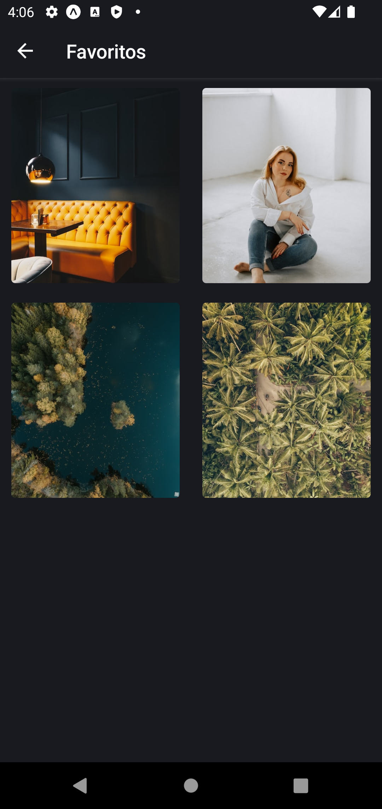

# # FotoFeed
Em resumo, o FotoFeed é um aplicativo de rolagem de fotos e salvamento de favoritos é uma ótima opção para aqueles que querem descobrir novas imagens e fotografias em um formato fácil de usar e salvar suas favoritas para acesso futuro. Ele oferece uma experiência de visualização de imagem simples e intuitiva.  

# Screenshots

  
  
  

  
  
   

  
  
  

## 💻:iphone:Tecnologias utilizadas 

- `React Native`
- `TypeScript`
- `Async-storage`
- `ContextApi`
- `Axios`
- `react-native-code-push`
- `appcenter`
- `Styled-components`
---

Made with ☕ by Edson da Silva

